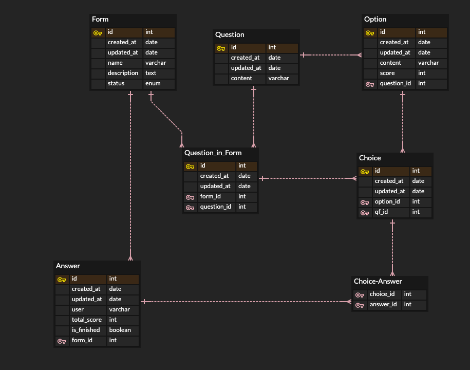

## 1. 사용 스택 및 개발 환경

- 사용 스택
  - TypeScript
  - NestJS
  - typeORM
  - GraphQL
  - PostGreSQL
  - winston
- 개발 환경
  - Node.JS v21.2.0
  - npm v10.2.4

<br><br><br>

## 2. 실행 방법

#### 1. 서버 실행 전 필요한 node_module 다운

```bash
npm i
```

<br>

#### 2. "npm run start:dev" 명령어를 통해 서버 실행

```bash
npm run start:dev
```

<br>

#### 3. 서버 접속

```bash
localhost:4000/graphql
```

<br><br><br>

## 3. ER Diagram



<br><br><br>

## 4. API 목록

### 엔드포인트 : localhost:4000/graphql

<br>

### 설문지(Form)

| 이름                   | 설명                         | Method   |
| ---------------------- | ---------------------------- | -------- |
| createForm             | 설문지 생성                  | Mutation |
| updateForm             | 설문지 수정                  | Mutation |
| removeForm             | 설문지 삭제                  | Mutation |
| finishForm             | 설문지 완료                  | Mutation |
| getAllForm             | 모든 설문지 조회             | Query    |
| getFormById            | 특정 ID의 설문지 조회        | Query    |
| getAllQuestionFromForm | 특정 설문지의 모든 문항 조회 | Query    |

<br>

### 문항(Question)

| 이름            | 설명                | Method   |
| --------------- | ------------------- | -------- |
| createQuestion  | 문항 생성           | Mutation |
| updateQuestion  | 문항 수정           | Mutation |
| removeQuestion  | 문항 삭제           | Mutation |
| getAllQuestion  | 모든 문항 조회      | Query    |
| getQuestionById | 특정 ID의 문항 조회 | Query    |

<br>

### 설문지 문항(Question-Form)

| 이름                   | 설명                 | Method   |
| ---------------------- | -------------------- | -------- |
| addQuestionToForm      | 설문지에 문항 추가   | Mutation |
| removeQuestionFromForm | 설문지에서 문항 삭제 | Mutation |

<br>

### 선택지(Option)

| 이름          | 설명                  | Method   |
| ------------- | --------------------- | -------- |
| createOption  | 선택지 생성           | Mutation |
| updateOption  | 선택지 수정           | Mutation |
| removeOption  | 선택지 삭제           | Mutation |
| getAllOption  | 모든 선택지 조회      | Query    |
| getOptionById | 특정 ID의 선택지 조회 | Query    |

<br>

### 선택한 선택지(Choice)

| 이름          | 설명                | Method   |
| ------------- | ------------------- | -------- |
| createChoice  | 문항 생성           | Mutation |
| removeChoice  | 문항 삭제           | Mutation |
| getChoiceById | 특정 ID의 문항 조회 | Query    |

<br>

### 답변(Answer)

| 이름                   | 설명                | Method   |
| ---------------------- | ------------------- | -------- |
| createAnswer           | 답변 생성           | Mutation |
| updateAnswer           | 답변 수정           | Mutation |
| removeAnswer           | 답변 삭제           | Mutation |
| getAllAnswer           | 모든 답변 조회      | Query    |
| getAnswerById          | 특정 ID의 답변 조회 | Query    |
| addChoiceToAnswer      | 답변에 선택 추가    | Mutation |
| removeChoiceFromAnswer | 답변에서 선택 삭제  | Mutation |
